# Azure Synapse-Purview QuickStart

  

## Table of Contents

* [Introduction](#introduction)
* [Prerequisites](#prerequisites)
* [Deployment](#deployment)
* [Post Deployment](#post-deployment)
* [Optional Step: Removing the QuickStart resources from the Purview Account](#optional-step-removing-the-quickstart-resources-from-the-purview-account)
* [Troubleshooting](#troubleshooting)

## Introduction

This QuickStart is a one-click solution to setup and configure Azure Purview Accounts. It deploys an Azure Synapse Analytics Workspace and connects it to the Purview account to push the data lineage. It creates storage accounts (blob and data lake storage) along with a dedicated SQL pool (in the synapse workspace), loads sample data into them, connects as data sources inside the Purview Account and finally creates and runs scans on all three registered data sources. It also reads Business Glossary Terms from a CSV file into the Purview account.

Click the following button to deploy the Purview QuickStart:-

Use the OneClick Deployment button above to start the deployment. Currently it takes ~25-30 minutes for one complete deployment.

* The following values are needed when using the OneClick Deployment ARM template:-
    * **Resource Group:** Name of the resource group.
    * **Region:** Azure region in which to create the resource group.
    * **New or existing Purview Account:** Whether to create a new Purview account or use an existing one.
    * **Purview Account Name:** Name of the Azure Purview Account. In case of new Purview account, give a new name. To use an existing one, enter the name of existing purview account.
    * **Data Lake Account Name:** Name of the ADSL2 storage account. This storage account will be created and registered as a data source with Purview account.
    * **Storage Account Name:** Name of the Blob storage account. This storage account will be created and registered as a data source with Purview account.
    * **Key Vault Name:** Name of the Azure Key vault. This is used to store Client Secret needed to perform API calls.
    * **Factory Name:** Name for the Azure Data Factory. This Data Factory will be created and load the data into the storage accounts.
    * **Aad App Client Id:** Client ID of the Application Registration created in prerequisite.
    * **Aad App Client Secret:** Client Secret of the Application Registration created in prerequisite.

## Prerequisites

There are two main prerequisites before deploying the Quickstart:-
* Create Application Registration
* Assignment of required roles

### 1. Create Application Registration

* Application registration needs to be created to enable authentication against the Azure Active Directory. Create an Application Registration in Azure Active Directory, which helps in establishing a trust relationship between application and the Microsoft identity platform.

  The complete procedure of creating the Application Registration and copying Client id and secret is shown below:-

    

      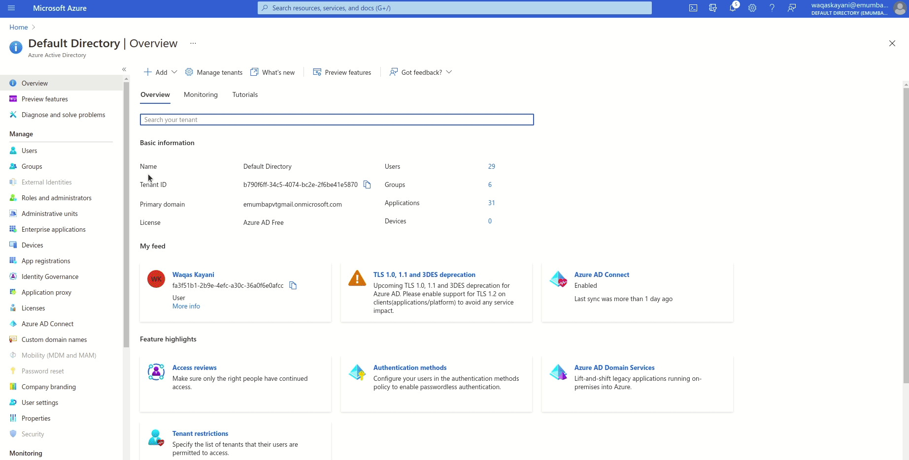
    

* Follow the steps below to create an application registration:-

    1. In Azure Homepage, search for `Active Directory` and select `Azure Active Directory` from the drop-down list.

    

      
    

    2. In Azure Active Directory page, select `App registrations` from the left pane.

    

      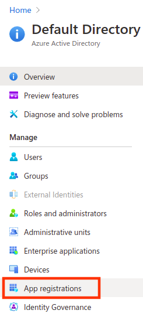
    

    3. Click `New registration` to create a new Application Registration.

    

      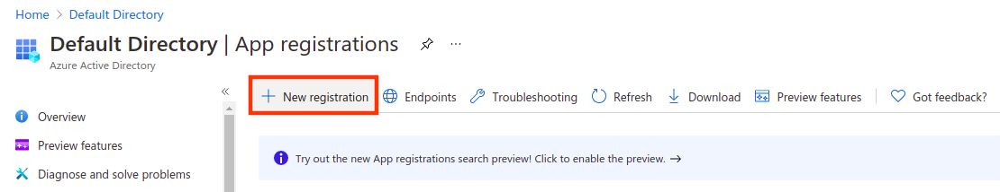
    

    4. Enter the following information:-
        * `Name`: Name for the new Application Registration.
        * `Supported account types`: Defines who can use this application
        * `Redirect URI`: (Optional) Authentication response is sent to this URI 

        **Supported account type** and **Redirect URI** can be left as default. Click on `Register` at the bottom when done.

    5. After a new registration is created, copy the client id as shown below:-

    

      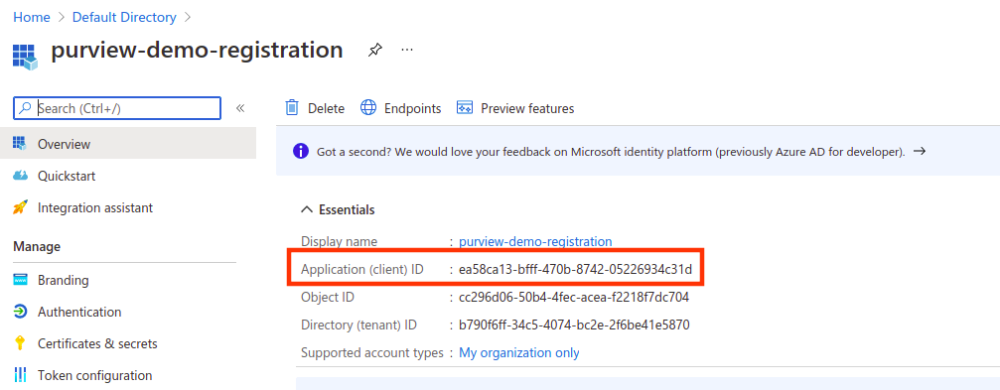
    

    6. Click on `Certificates & secrets` on the left pane:-

    

      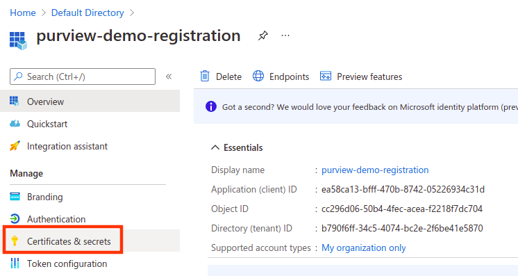
    

    7. Click on `New client secret` to create a new secret id for application registration:-

    

      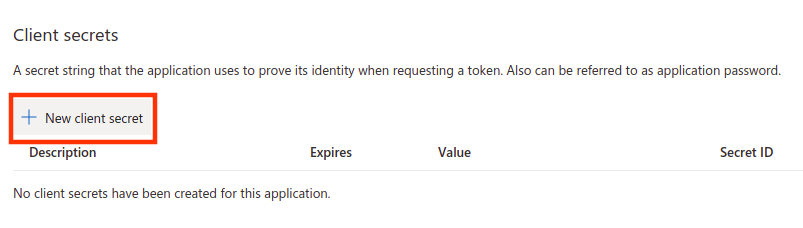
    

  8. Enter a description, select the expiration of secret id and click `Add` at the bottom:-

    

      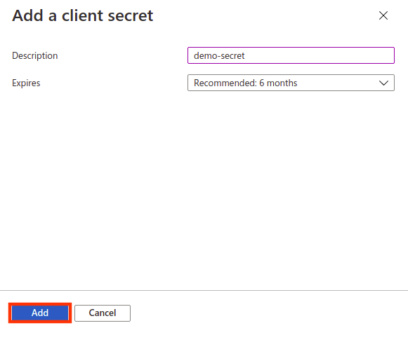
    

    9. Copy the secret id under `Value` column as shown below:-

    

      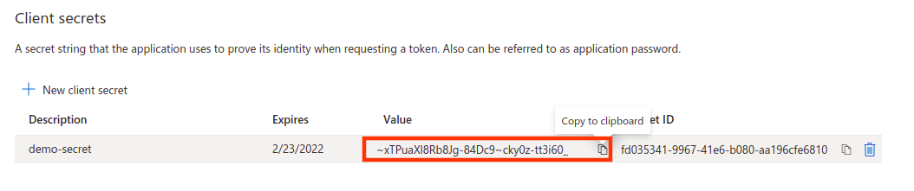
    

### 2. Assignment of required roles

* To give application access to the subscription, in Azure Subscription console, add a role assignment of role `Purview Data Curator` and `Purview Data Source Administrator` to the Service Principal App registration created earlier.

  The complete procedure of adding the required roles to the Application Registration is shown below:-

    

      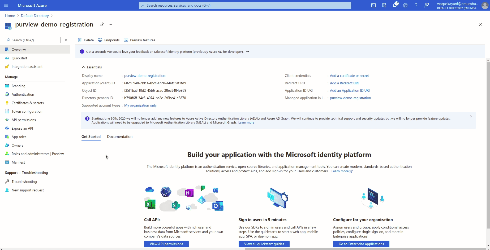
    

  The following table illustrates the required roles and permissions:-

  <table>
      <thead>
          <tr>
              <th>Feature/Service</th>
              <th>Role Assigned</th>
          </tr>
      </thead>
      <tbody>
          <tr>
              <td rowspan=2>Application Registration</td>
              <td>Purview Data Curator</td>
          </tr>
          <tr>
              <td>Purview Data Source Administrator</td>
          </tr>
      </tbody>
  </table>

* Follow the steps below to assign required roles to the application registration:-

    1. With Application registration created, search for `Subscription` and select `Subscriptions` from the drop-down list:-

    

      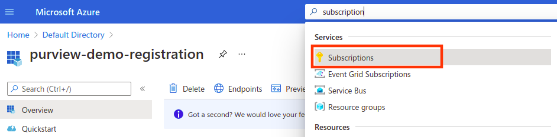
    

    2. Select the Azure Subscription and click `Access control (IAM)`:-

    

      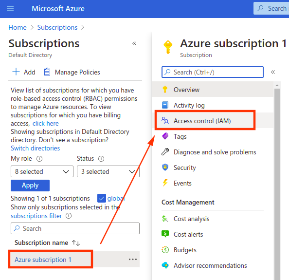
    

    3. To attach the required roles to Application registration, choose `Add` and select `Add role assignment` from the drop down list:-

    

      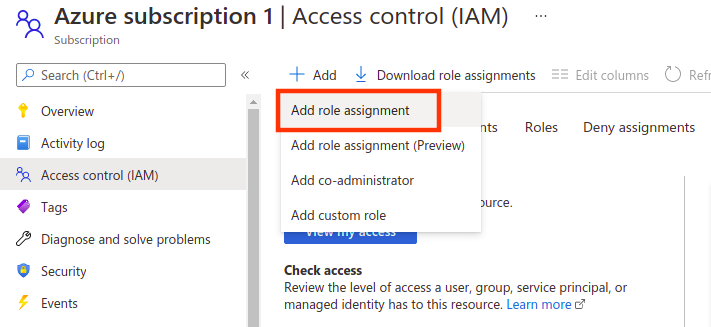
    

    4. To add role assignment, search for `Purview Data Curator` role and under `Select` search for the service principal created earlier as shown below. Click on the application registration to select it:-

    

      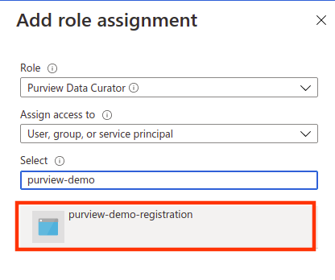
    

    5. Make sure the application registration shows under `Selected members`. Click `Save` to add role:-

    

      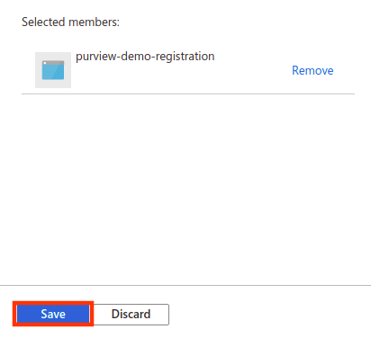
    

    6. Repeat the same procedure to add `Purview Data Source Administrator` role to the Application registration as well.

## Post Deployment

After the deployment is complete, follow the steps given below to view the artifacts created inside the Purview Studio:

1. Click on the `Go to resource group` button and then click on the Purview account name.

  

    

  

2. Click on the `Open` link inside the box labelled as 'Open Purview Studio'. The purview studio will be browsed in a new tab.

  

3. You will see that there are two sources, a few assets and a glossary term created in the Purview Studio.

  

4. Now click on the `Data map` tab in the left vertical panel. You will see two sources (blob storage and data lake storage) registered as data sources.

  

5. Now click on `View details` link inside data lake source box. You will see a scan already created.

  

  

6. Click on the `Scans` tab and click on the scan.

  

7. You will see a successful scan run (or may be still under progress or queued).

  

8. For the blob storage data source, repeat the steps 5,6 and 7.

9. Now click on the `Data catalog` tab in the left vertical panel and click on the `Manage glossary` box.

  

10. You will a demo glossary term.

  

## Optional Step: Removing the QuickStart resources from the Purview Account

The complete procedure to remove the created resources is shown below:-

  

    
  

  
After the deployment is complete, resources can be deleted by following the steps below:-

  1. On the deployment page, click on `Outputs`:-

  

    
  

  2. Copy and run the `deletePurviewFunctionTriggerUrl` URL from the deployment outputs:-

  

    
  

## Troubleshooting

This portion lists solutions to problems one might encounter with Purview OneClick Deployment.

### Common Problems

Here is a list of common problems one might encounter while deploying the template:-

#### 1. Purview Account created but `no` QuickStart resources were found:

In case the deployment is successful and there aren't any resources created. It can be verified by going to the Purview Account Portal. That is caused by the time Purview Account needs to set up properly. Resources can be provisioned using the `configurePurviewFunctionTriggerUrl` url from the deployment outputs. The same url needs to be used to trigger the creation function after some time, in case it does not work in first attempt. It should output `AzurePurview Creation function triggered successfully`. 

The following gif illustrates the procedure for creation of resources:-

  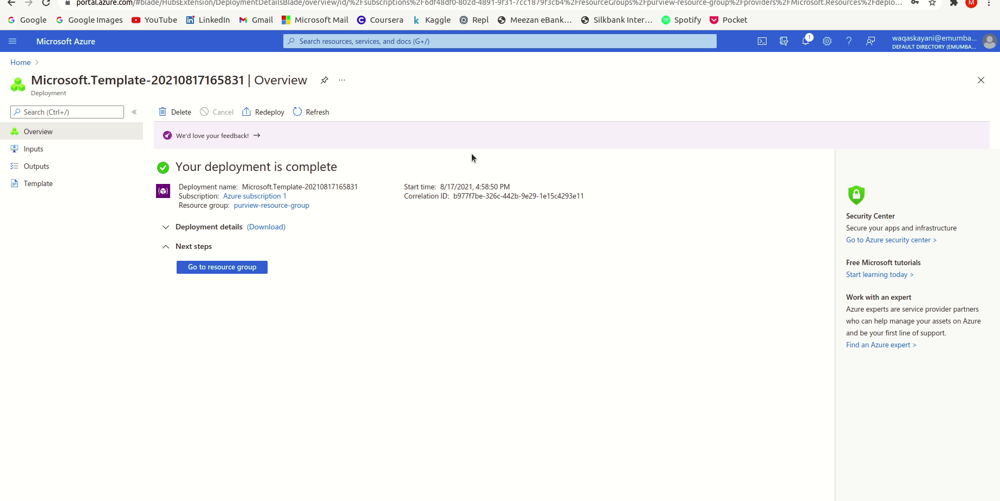

The following explains the working of deployment script in this case:-

  * Unresponsive APIs return a status code of 500.
  * The deployment script waits for 1 minute and retries to get a status code of 200.
  * In case of success status code return, the script creates the resources.
  * In case of status code 500 return, the script does 15 retries, with 1 minute wait each time.
  * If APIs are still unresponsive, the deployment script completes the deployment without provisioning resources.

#### 2. Failed Deployment

* Deployment failed on `runDataFactory` step.
* Deployment failed on `triggerConfigurePurviewFunction` step.

In case the deployment failed, this can be caused by the Powershell modules used in the deployment script.
Make sure that:-

* The App Registration client ID and client secret are correct.
* The application service principal has access to the `Purview Data Curator` and `Purview Data Source Administrator` roles at subscription level.

If the above requirements are satisfied, rerunning the deployment should resolve this issue.
