# Azure Synapse-Purview QuickStart

  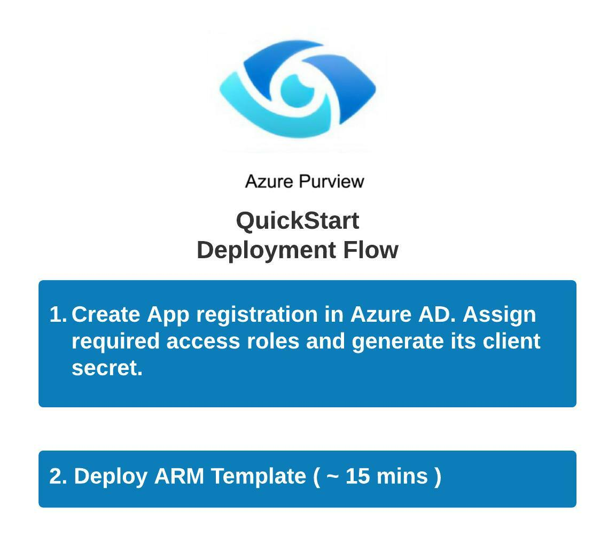

## Table of Contents

* [Introduction](#introduction)
* [Prerequisites](#prerequisites)
* [Deployment](#deployment)
* [Post Deployment](#post-deployment)

## Introduction

This QuickStart is a one-click solution to setup and configure Azure Purview Accounts. It deploys an Azure Synapse Analytics Workspace and connects it to the Purview account to push the data lineage. It creates storage accounts (blob and data lake storage) along with a dedicated SQL pool (in the synapse workspace), loads sample data into them, connects as data sources inside the Purview Account and finally creates and runs scans on all three registered data sources. It also reads Business Glossary Terms from a CSV file into the Purview account.

## Prerequisites

The (signed-in) user creating the deployment must have the following roles assigned to it:

### RBAC Roles

Owner (scope: subscription)

**OR** 

Contributor + User Access Administrator (scope: subscription)

These roles are required to create this deployment which includes deployment of diffrent azure services along with RBAC role assignments.

Following two links will help you assign these RBAC roles:

1- [Steps to assign an Azure role](https://docs.microsoft.com/en-us/azure/role-based-access-control/role-assignments-steps)

2- [Assign Azure roles using the Azure portal](https://docs.microsoft.com/en-us/azure/role-based-access-control/role-assignments-portal?tabs=current)

### Azure Active Directory Roles

Application Administrator

This role is required to create the app registration/service principal and related configurations i.e. assigning API pemissions and granting consent.

Follow the link to [Assign administrator and non-administrator roles to users with Azure Active Directory](https://docs.microsoft.com/en-us/azure/active-directory/fundamentals/active-directory-users-assign-role-azure-portal).

## Deployment

1- Click the following button to deploy the Synapse-Purview QuickStart:-

2- The following values are needed as deployment parameters when using the OneClick Deployment ARM template:-
  * **Resource Group:** Name of the resource group.
  * **Region:** Azure region in which to create the resource group. All services will be deployed in this region (location).
  * **New or existing Purview Account:** Whether to create a new Purview account or use an existing one.
  * **Purview Account Name:** Name of the Azure Purview Account. In case of new Purview account, give a new name. To use an existing one, enter the name of existing purview account.
  * **Data Lake Account Name:** Name of the ADSL2 storage account. This storage account will be created and registered as a data source with Purview account.
  * **Storage Account Name:** Name of the Blob storage account. This storage account will be created and registered as a data source with Purview account.
  * **Key Vault Name:** Name of the Azure Key vault. This is used to store Client Secret needed to perform API calls.
  * **Synapse Name:** Name for the Azure Synapse Analytics. This account will be registered as a data source with Purview account. A dedicated SQL pool and two pipelines will be created inside this synapse account.
  * **Sql Administrator Login:** Username of SQL administrator for Synapse.
  * **Sql Administrator Login Password:** Password of SQL administrator for Synapse
  * **User Azure Login Id:** Azure login email/ID of the signed-in user.
  * **User Azure Login Password:** Azure login password of the signed-in user.

3- Click 'Review + Create'.

4- On successful validation, click 'Create'.

## Post Deployment

After the deployment is complete, follow the steps given below to view the artifacts created inside the Purview Studio:

1. Click on the `Go to resource group` button and then click on the Purview account name.

  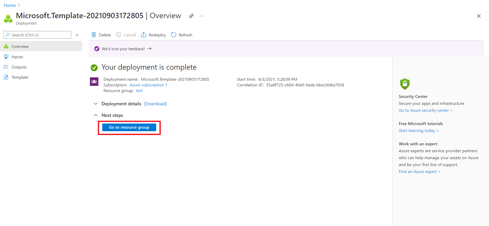

    

  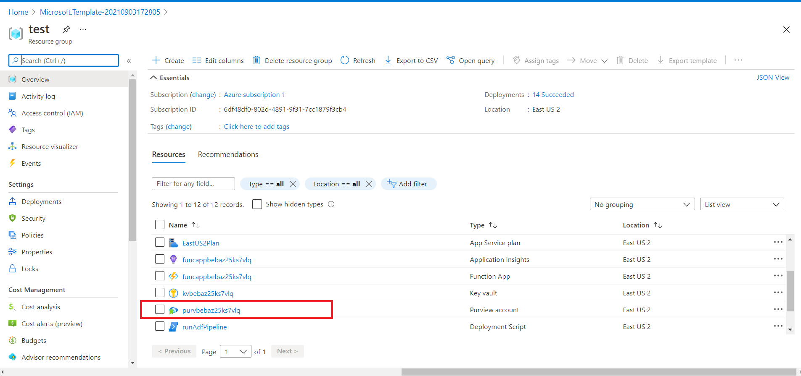

2. Click on the `Open` link inside the box labelled as 'Open Purview Studio'. The purview studio will be browsed in a new tab.

  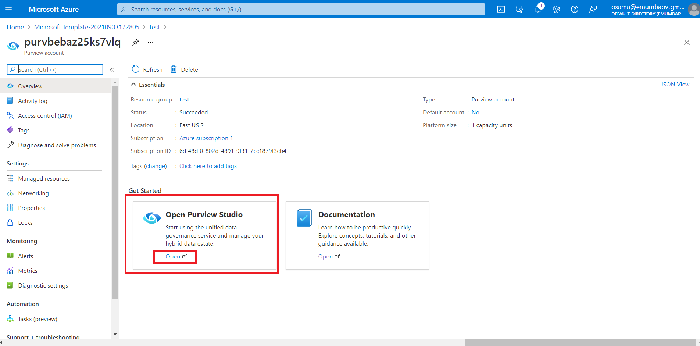

3. You will see that there are two sources, a few assets and a glossary term created in the Purview Studio.

  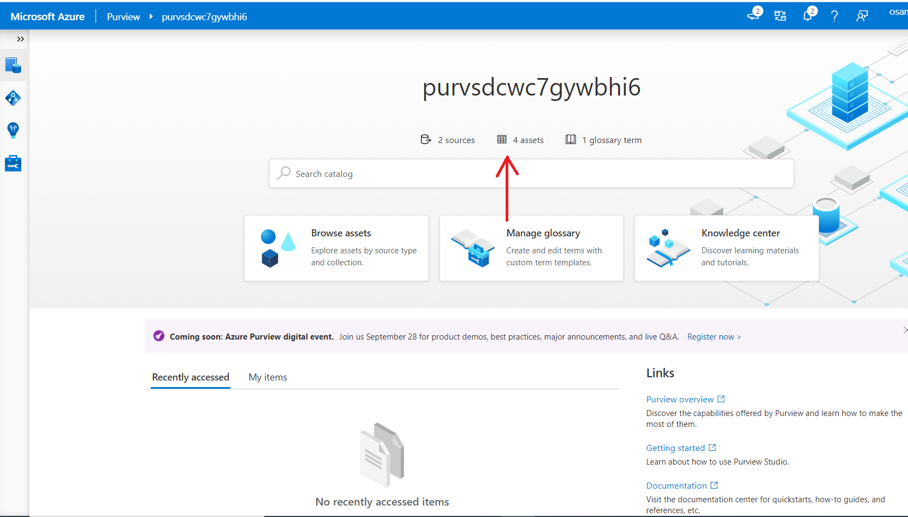

4. Now click on the `Data map` tab in the left vertical panel. You will see two sources (blob storage and data lake storage) registered as data sources.

  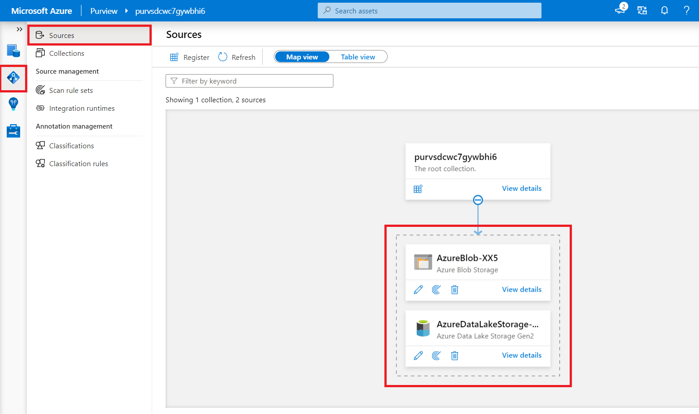

5. Now click on `View details` link inside data lake source box. You will see a scan already created.

  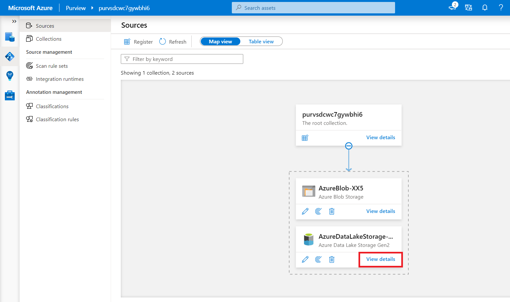

  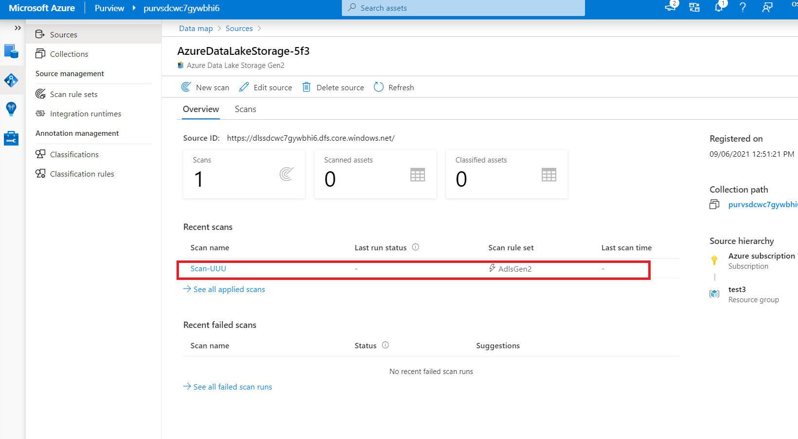

6. Click on the `Scans` tab and click on the scan.

  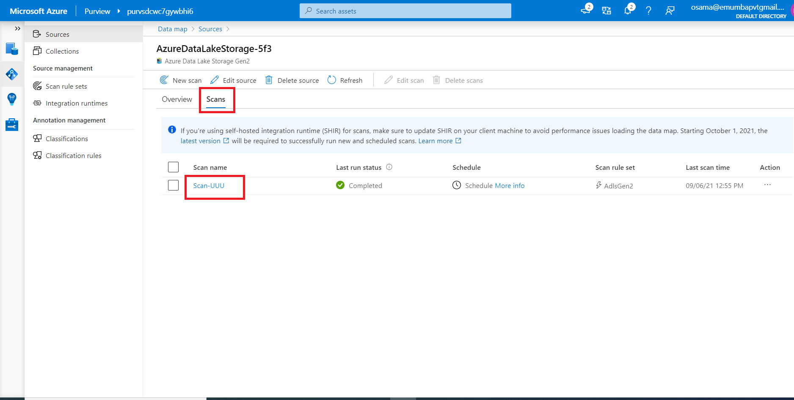

7. You will see a successful scan run (or may be still under progress or queued).

  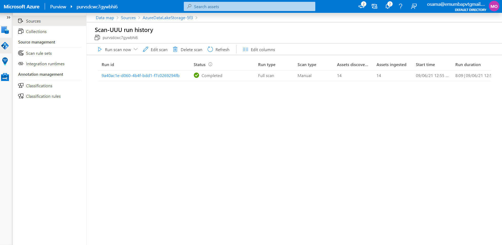

8. For the blob storage data source, repeat the steps 5,6 and 7.

9. Now click on the `Data catalog` tab in the left vertical panel and click on the `Manage glossary` box.

  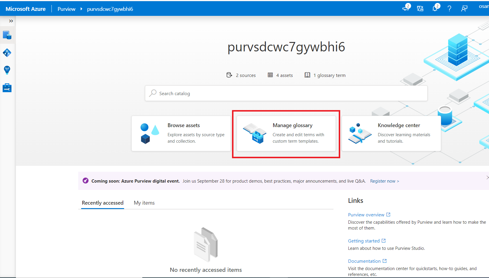

10. You will a demo glossary term.

  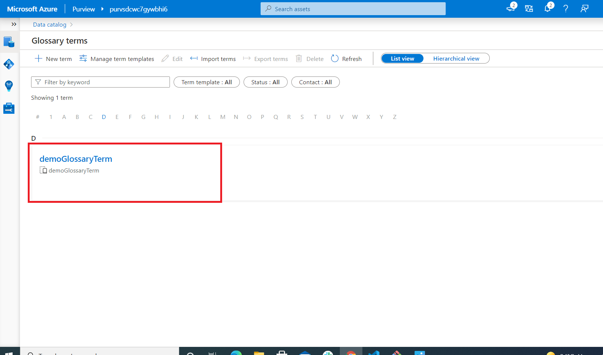

## Optional Step: Removing the QuickStart resources from the Purview Account

The complete procedure to remove the created resources is shown below:-

  

    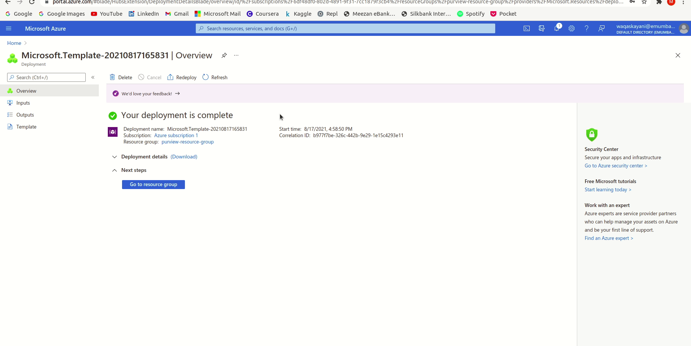
  

  
After the deployment is complete, resources can be deleted by following the steps below:-

  1. On the deployment page, click on `Outputs`:-

  

    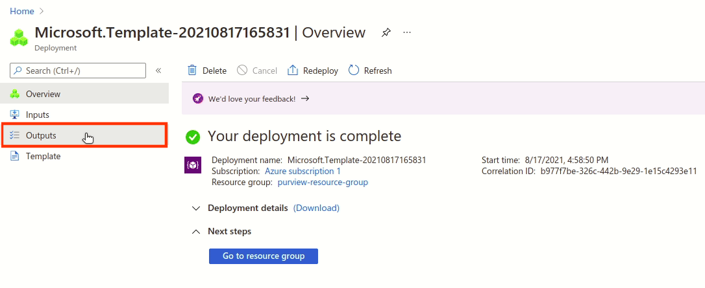
  

  2. Copy and run the `deletePurviewFunctionTriggerUrl` URL from the deployment outputs:-

  

    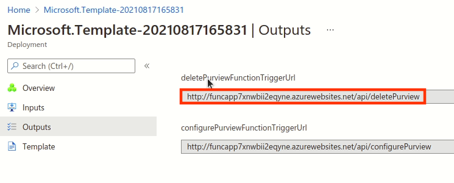
  

